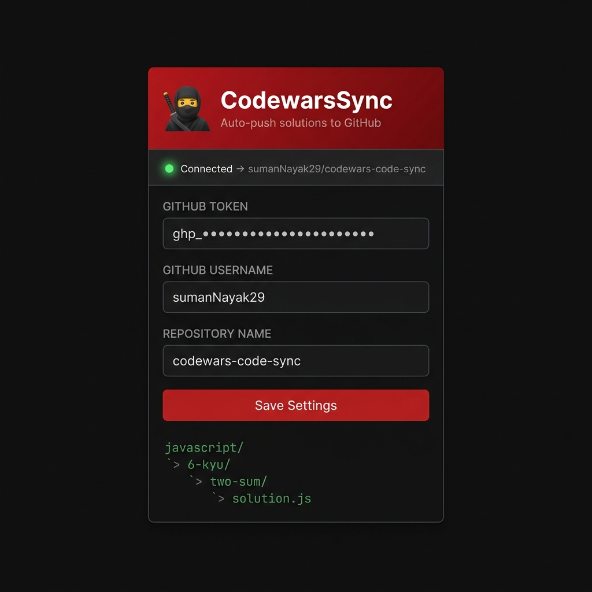
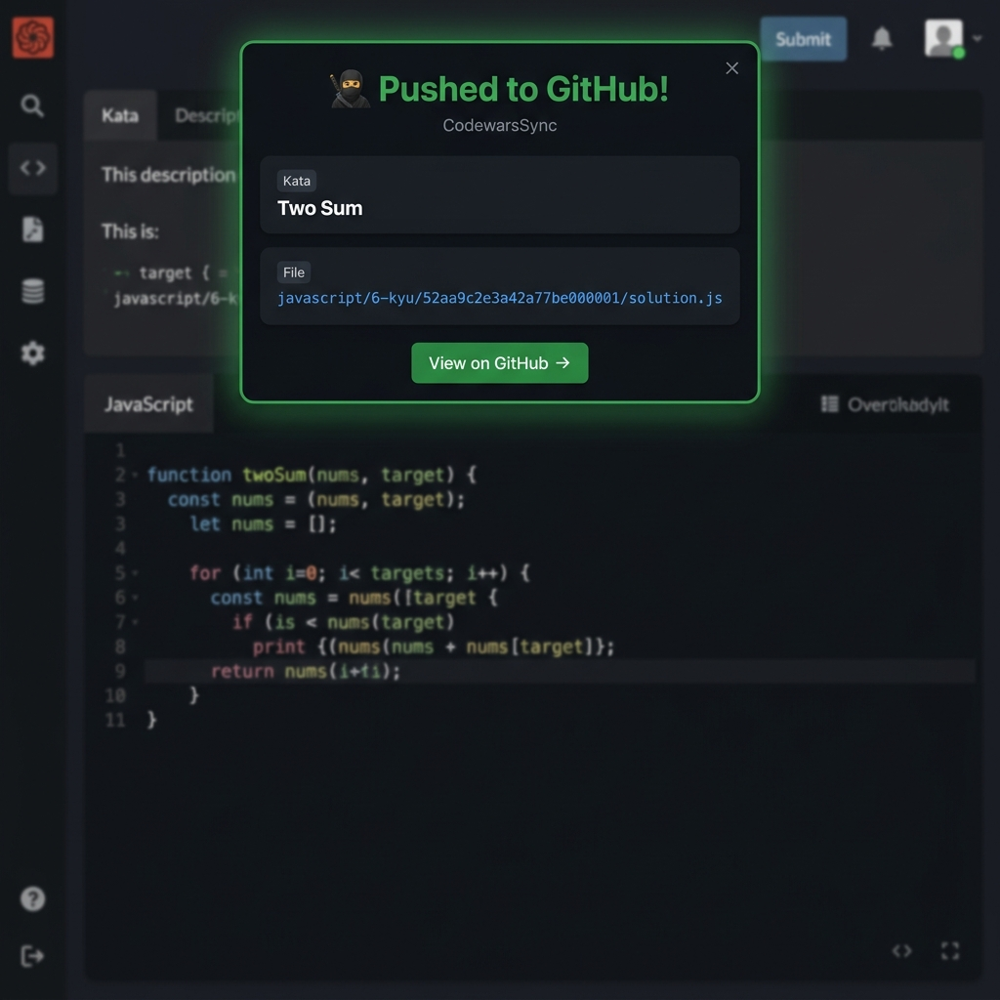
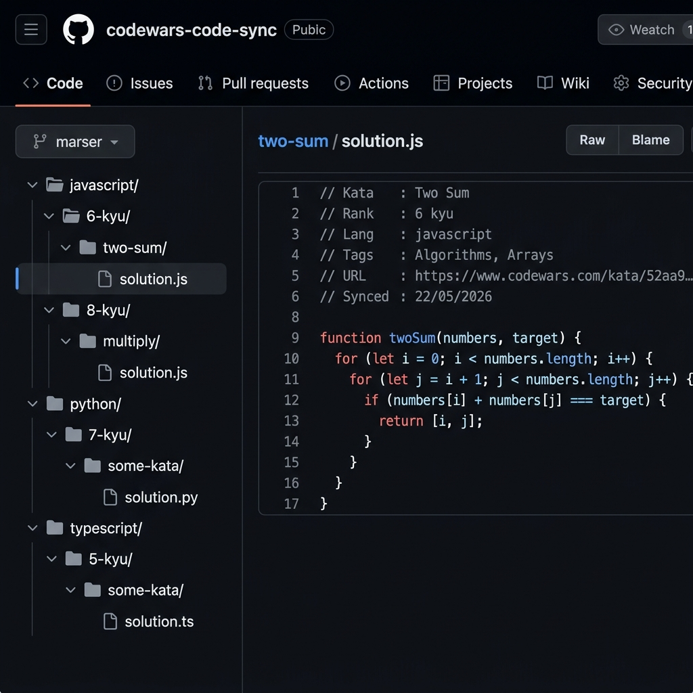

# 🥷 CodewarsSync

A Chrome extension that automatically pushes your Codewars solutions to GitHub when you submit a passing kata.

---

## Setup

### 1. Create a GitHub Repository

Create a new repository (e.g. `codewars-code-sync`) on GitHub. It must exist before the extension can push to it.

### 2. Generate a GitHub Token

1. Go to [github.com/settings/tokens/new](https://github.com/settings/tokens/new)
2. Select the **`repo`** scope
3. Generate and copy the token

### 3. Install the Extension

1. Open `chrome://extensions` in Chrome
2. Enable **Developer mode**
3. Click **Load unpacked** and select this folder

### 4. Configure

Click the 🥷 icon in the toolbar, fill in your token, username, and repository name, then click **Save Settings**.



The status bar turns green once your credentials are validated.

---

## Usage

Solve a kata on Codewars and click **Submit**. If all tests pass, the extension automatically pushes your solution to GitHub and shows a confirmation banner.



> Sync only fires on **Submit** — not on "Run Tests" — so only final passing solutions are pushed.

---

## Repository Structure

Solutions are stored as `{language}/{rank}/{kata-slug}/solution.{ext}`.



Each file includes a metadata header:

```js
// Kata   : Two Sum
// Rank   : 6 kyu
// Lang   : javascript
// Tags   : Algorithms, Arrays
// URL    : https://www.codewars.com/kata/52aa9c2e3a42a77be000001
// Synced : 22/05/2026
```

---

## Supported Languages

JavaScript, TypeScript, Python, Ruby, Java, C#, C++, C, Go, Rust, Kotlin, Swift, PHP, Scala, Haskell, Elixir, CoffeeScript, Dart, Shell, R

---

## Troubleshooting

| Problem | Fix |
|---|---|
| No banner after Submit | Open DevTools → Console and check for `[CodewarsSync]` logs |
| "Not configured" toast | Open the popup and save your settings |
| "Repo not found" | Confirm the repo exists and the username/repo name are correct |
| "Invalid token" | Regenerate your GitHub token with `repo` scope |
| "Could not read code" | Refresh the page and re-submit |
